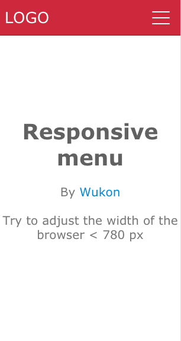

## Web Components -- Responsive menu
> Creating responsive menu using css3 and jQuery.

- Mobiles will initially hide the navigation until a button is tapped.
- Funny menu icon animation
- "Flip" the menu from vertical to horizontal view

## Demo
<a href="http://codepen.io/steveliao/pen/xOvZko" target="_blank">Web Components -- Responsive menu</a>

 

