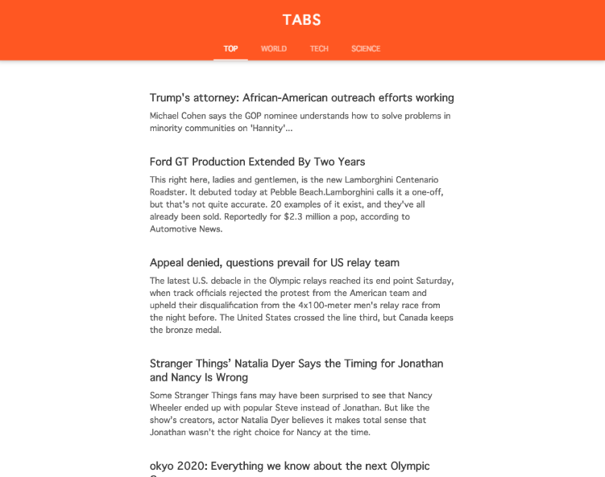

## Web Components -- Tabs
> Creating simple tabs using jQuery.

- This demo is a News page with tabs
- Simple animation
- Responsive layout

## Demo
<a href="http://codepen.io/steveliao/pen/YWrmgO" target="_blank">Web Components -- Tabs</a>

 

